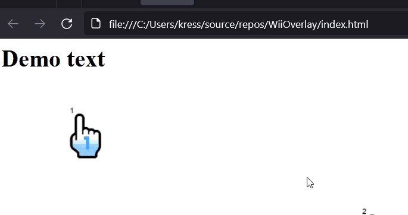

# WiiOverlay.js
A simple library to overlay Wii features on top of an ordinary website.

## Progress
There's a basic cursor overlay.

## Wanted features

 - Interactive Home menu: It should open up on top of the website, sliding in from top and bottom like it does on the Wii.

 - Sounds: You should be able to enable the iconic audio of the Wii on wii actions.